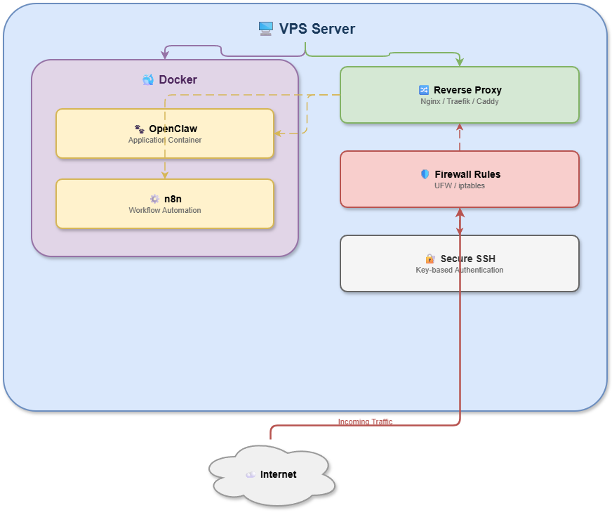

# AI Automation Infrastructure (Self-Hosted on OCI)

This project documents the design, deployment, and security hardening of a self-hosted AI automation platform running on Oracle Cloud Infrastructure (OCI).

The objective is to build production-oriented AI infrastructure without relying entirely on managed cloud services.

---

## 🏗 Architecture Overview

### High-Level Flow

User → HTTPS → Reverse Proxy → Docker Network → OpenClaw ↔ n8n

---

## 🚀 Core Components

- OpenClaw (AI execution layer)
- n8n (Workflow automation engine)
- Docker containerization
- Reverse proxy (TLS termination & route separation)
- Secure API exposure
- VPS hardening & firewall configuration

---

## 🌐 Cloud Deployment (Oracle Cloud Infrastructure)

- Hosted on OCI Compute Instance
- Configured VCN and subnet rules
- Public IP restricted to ports 80/443 only
- Internal services isolated via Docker network
- Controlled ingress/egress rules

---

## 🔐 Security Architecture

### Public Exposure Policy

Only ports:
- 80 (HTTP)
- 443 (HTTPS)

All internal service ports (3000, 5678, 8080) are restricted to private Docker networking.

### Security Controls

- SSH hardened and brute-force protected
- No direct container exposure to internet
- Reverse proxy handles TLS termination
- Environment variables isolated via `.env`
- Separation of public and internal service layers

---

## ⚙ Engineering Challenges Solved

- Debugged HTML vs JSON API misrouting caused by reverse proxy path conflicts
- Resolved incorrect REST endpoint exposure
- Managed environment variable injection across services
- Implemented network isolation between containers

---

## 📈 Engineering Focus

This project demonstrates:

- AI infrastructure deployment
- Docker networking & isolation
- Reverse proxy configuration
- Cloud network segmentation
- Production-style security design
- AI workflow orchestration (MCP integration)
