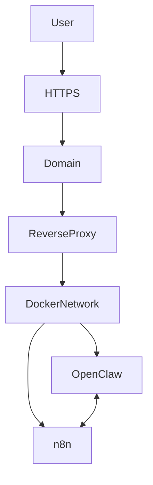

# OpenClaw Architecture

## Visual Diagram

---

## Logical Flow (Mermaid)

---

## Layered Architecture Explanation

### 1. Cloud Layer (Oracle Cloud Infrastructure)

- Hosted on OCI Compute Instance
- Public IP attached to instance
- Ingress restricted to ports 80 / 443
- SSH hardened and restricted

---

### 2. Network & Security Layer

- Reverse proxy handles:
  - TLS termination (HTTPS)
  - Route separation (UI vs API)
- No direct exposure of container ports
- Internal services communicate via private Docker network

---

### 3. Container Layer

- OpenClaw and n8n run as isolated Docker containers
- Restart policies enabled
- Environment variables managed via `.env`
- No public container port bindings

---

### 4. Application Layer

- OpenClaw executes AI tasks
- n8n orchestrates automation workflows
- Internal API communication secured within Docker network

## Design Principles

- Least privilege port exposure
- Network isolation between public and internal services
- Separation of routing and execution layers
- Secure environment configuration management
